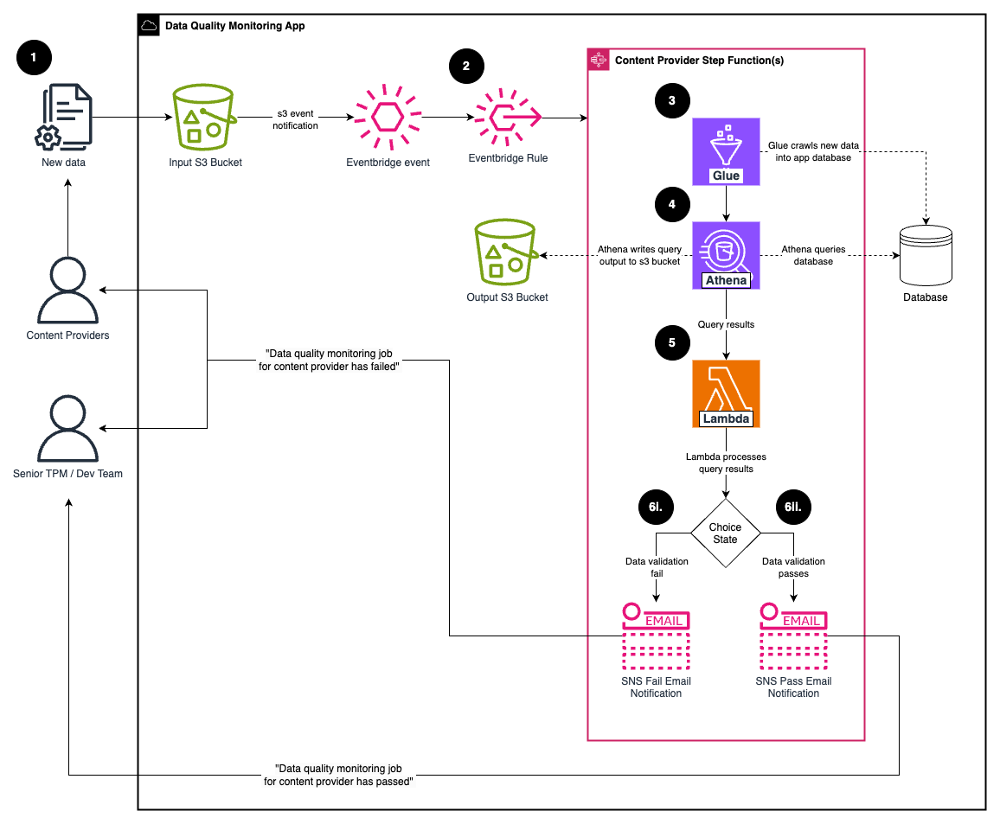
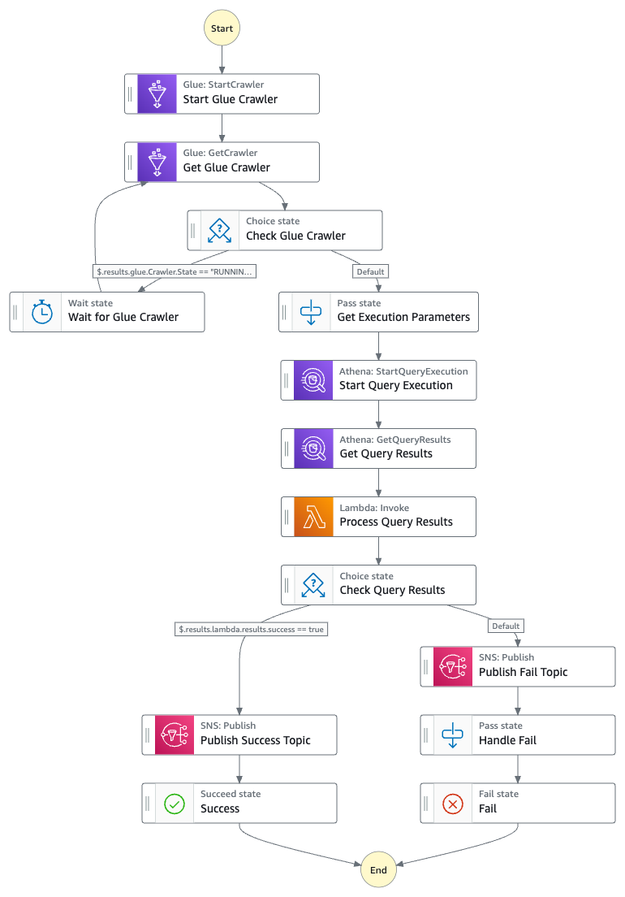

# Data Quality Monitoring App
- [Introduction](#introduction)
- [Directory](#directory)
- [Deployment](#deployment)
- [Assumptions](#assumptions)
- [Limitations](#limitations)
- [Alternatives Considered](#alternatives-considered)
- [High Level Graph](#high-level-graph)
- [Content Provider Step Function Graph](#content-provider-step-function-graph)
- [Useful commands](#useful-commands)
- [On-boarding Content Providers](#on-boarding-content-providers)

### Introduction
The Data Quality Monitoring App is a solution designed to monitor and ensure the quality of data ingested from various 
content providers meets the standards set in the agreed contracts. The app is designed to address two specific objectives:
1. **Build a data quality monitoring application**:
Build a scalable AWS application that automates data quality checks on new data and sends results to subscribed stakeholders within 1 hour.
2. **Maximise initial error detection**:
Pilot the application with the Beta Content Provider, which supplies 70% of existing Q&A pairs.
### Directory
* [.github](.github) - directory for GitHub files
  * [workflows](.github/workflows) - directory for workflows
    * [build](.github/workflows/build.yml) - CI/CD workflow to unit test, e2e-test and, deploy app
    * [super-linter](.github/workflows/super-linter.yml) - Lint workflow to lint codebase
  * [dependabot](.github/dependabot.yml) - dependabot workflow to scan for outdated dependencies
* [bin](bin) - directory for executable scripts
  * [dev](bin/dev.ts) - creates app dev stack
  * [prod](bin/prod.ts) - creates app prod stack
* [lib](lib) - main library directory
  * [constructs](lib/constructs) - directory for reusable CDK constructs
    * [s3.ts](lib/constructs/s3.ts) - construct for creating app input and output buckets
    * [database.ts](lib/constructs/database.ts) - construct for creating app database
    * [glue.ts](lib/constructs/glue.ts) - construct for creating Glue resources
    * [athena.ts](lib/constructs/athena.ts) - construct for creating Athena resources
    * [lambda.ts](lib/constructs/lambda.ts) - construct for creating Lambda resources
    * [sns.ts](lib/constructs/sns.ts) - construct for creating SNS topics and subscriptions
    * [content-provider.ts](lib/constructs/content-provider.ts) - construct for creating Content Provider specific step functions
  * [functions](lib/functions) - directory for lambda functions
    * [process-query-results.ts](lib/functions/process-query-results.ts) - lambda function that processes Athena query results at runtime
    * [index.ts](lib/functions/index.ts) - exports process query results handler
  * [index.ts](lib/index.ts) - main entry point for creating the app stack 
* [resources](resources) - directory for containing content provider specific resources
  * [beta-content-provider](resources/beta-content-provider) - directory for beta content provider resources
    * [athena-query.sql](resources/beta-content-provider/athena-query.sql) - data quality check in the format of a statistical SQL query
    * [sns-config.json](resources/beta-content-provider/sns-config.json) - SNS config containing message format and topic subscriptions
  * [test-content-provider](resources/test-content-provider) - directory for test resources 
* [unit-test](unit-test) - directory for unit tests
  * [constructs](unit-test/constructs) - directory for CDK construct unit tests
    * [s3.test.ts](unit-test/constructs/s3.test.ts) - unit tests for s3 construct
    * [database.test.ts](unit-test/constructs/database.test.ts) - unit tests for database construct
    * [glue.test.ts](unit-test/constructs/glue.test.ts) - unit tests for database construct
    * [athena.test.ts](unit-test/constructs/athena.test.ts) - unit tests for athena construct
    * [lambda.test.ts](unit-test/constructs/lambda.test.ts) - unit tests for lambda construct
    * [sns.test.ts](unit-test/constructs/sns.test.ts) - unit tests for sns construct
    * [content-provider.test.ts](unit-test/constructs/content-provider.test.ts) - unit tests for content provider construct
  * [functions](unit-test/functions) - directory for lambda function tests
      * [process-query-results.test.ts](unit-test/functions/process-query-results.test.ts) - unit tests for process query results handler
  * [index.test.ts](unit-test/index.test.ts) - unit tests for app stack
* [e2e-test](e2e-test) - directory for end-to-end tests
  * [beta-content-provider.test.ts](e2e-test/beta-content-provider.test.ts) - e2e tests for beta content provider

### Deployment
Automatic deployment is handled through GitHub actions (see: [build workflow](.github/workflows/build.yml)), which executes three jobs:
1. `unit-test` - Runs unit tests, uploads coverage report and synthesized CloudFormation template
2. `e2e-test` - Deploys dev stack, runs e2e tests, and destroys dev stack
3. `deploy` - Deploys prod stack

### Assumptions
* As the shared Content Provider s3 bucket was depreciated, the app needed to create the input s3 bucket that would contain 
data files relating to Content Providers.
* Due to the reason above, locale was ignored to simplify the process.

### Limitations

* Only supports csv files for now, though should be simple to add support for json/parquet files.
* In the case of multiple upload events in a short period, if the content provider step function has not finished
  executing for the first upload then the step function will fail for subsequent uploads.
* There is no implemented error handling/notification if an error occurs during execution of glue, athena, and lambda tasks.
* SNS subscriptions need to be accepted before messages are received.
* Input bucket is coupled with the application, in reality this would not be the case, and it would be an input to the app.
* Can only execute one query (data validation rule), for one content provider. Can work around by adding additional
  validation to sql query.
* In reality, Content providers have data files for multiple locales, this was not factored in the design of the app.
* No load testing was performed to ascertain the limits of created step functions. Currently, step functions timeout
  after 5 minutes if execution is not complete, might need to adjust this value for when larger data volumes are ingested.

### Alternatives Considered
* **S3 Select** - Does not allow aggregate sql functions to be performed making its benefits redundant.
* **Glue Jobs (without Athena)** - Burner accounts do not have Glue job concurrency, the fact Amazon restricts Glue Jobs, combined 
with the fact Glue jobs currently cost the team the most per month in terms of AWS resources, this leads me to think that this
is a costly design decision.
* **Glue Databrew** - Good alternative. Athena can perform statistical analysis on content provider data in one step. 
With Glue Databrew however, it is separated into two steps, transforming the data into overall statistics using a RecipeJob 
and running data validation rules using a ProfileJob. Glue Databrew does simplify creation of data validation rules and is
capable of cleaning data. Athena was chosen instead Glue Databrew at design due to issues with Glue Databrew being confused 
with the limitations of CloudFormation templates. In hindsight however, the move to AWS CDK changes things, and I now suspect 
Glue Databrew might be the better approach.

### High Level Graph

The following workflow operates for Content Providers set up in the app:
1. Content providers upload new data file(s) to input s3 bucket.
2. Input s3 bucket sends an upload s3 event notification to EventBridge, if it matches the event rule set up for the 
Content Provider step function, then it triggers its execution.
3. Glue crawls all new data files found for that Content Provider into the app database.
4. Athena queries the database using a query string (see example [sql file](resources/beta-content-provider/athena-query.sql)). 
The sql file contains all the data validation logic/rules to execute for that Content Provider. The result of the executed 
Athena query is stored in the app output s3 bucket.
5. Athena does not return data in the format we want, so the query result needs to be processed. A Lambda is used to 
process the results containing key information of the ingested data file(s) and a boolean `success` which is `true` or `false` if the 
file passes the set data validation logic/rules.
6. 
   1. If the query result's `success` is `false`, SNS publishes a failure email notification to fail topic subscribers 
(see example [sns-config](resources/beta-content-provider/sns-config.json)), then the state machine ends with 
a `FAILED` status.
   2. If the query result's `success` is `true`, SNS publishes a success email notification to success topic subscribers
(see example [sns-config](resources/beta-content-provider/sns-config.json)), then the state machine ends with
a `SUCCEEDED` status.
   
### Content Provider Step Function Graph

### Useful commands

* `npm run build`   compile typescript to js
* `npm run test:unit`    perform the jest unit tests
* `npm run test:e2e`    perform the jest e2e tests
* `npx cdk synth > template.yaml`   emits the synthesized CloudFormation template
* `npm run cdk:deploy:dev`  deploy app dev stack (see: [dev.ts](bin/dev.ts))
* `npm run cdk:deploy:prod`  deploy app prod stack (see: [prod.ts](bin/prod.ts))
* `npm run cdk:destroy:dev`  destroy app dev stack

### On-boarding Content Providers

1. Create [resources](resources) content provider specific subfolder under same s3 path as content provider in input bucket. 
e.g `input-bucket/example-content-provider` -> `resources/example-content-provider` and add following files:
   1. `athena-query.sql` - containing sql query that performs statistical analysis on content provider data.
   2. `sns-config.json` - containing the message format relayed to stakeholders during step function execution and stakeholder
subscriptions.
2. Add `new ContentProvider(this, 'ExampleContentProvider', { ..otherParams, contentProviderPath: 'example-content-provider' });`
to `DataQualityMonitoringAppStack` in [index](lib/index.ts).
3. (Optional) Add content provider e2e test file in [e2e-test](e2e-test), e.g. `example-content-provider.test.ts`
